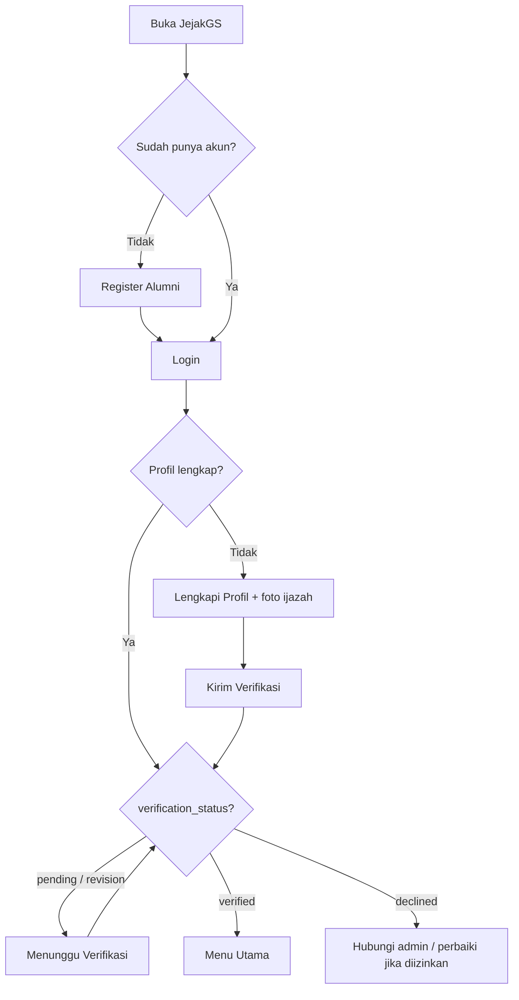
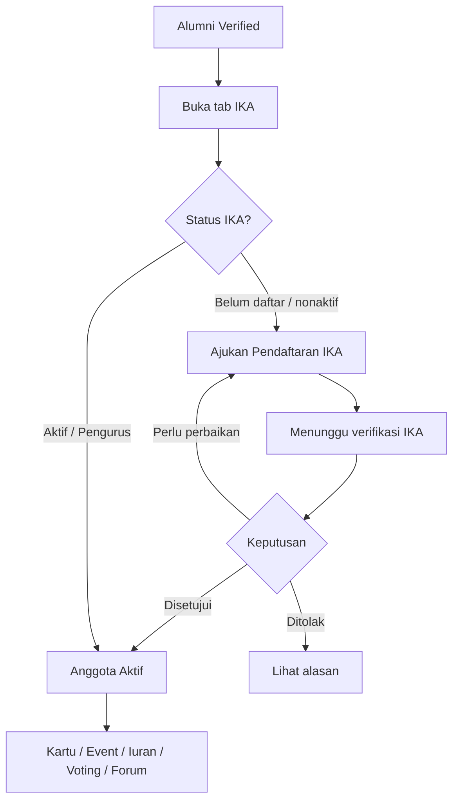
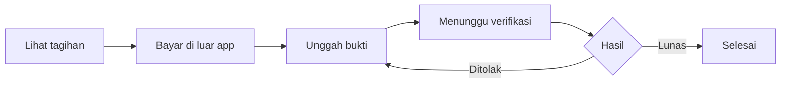

# Panduan Lengkap JejakGS

Panduan ini menjelaskan fitur, alur bisnis, dan cara menggunakan aplikasi **JejakGS** — aplikasi mobile alumni STIKES Gunung Sari yang terhubung ke sistem **SIMAWA-GS**.

Versi dokumen mengikuti perilaku aplikasi pada build **1.0.4+**.

---

## Daftar Isi

1. [Tentang JejakGS](#1-tentang-jejakgs)
2. [Pengguna dan Peran](#2-pengguna-dan-peran)
3. [Arsitektur Layanan](#3-arsitektur-layanan)
4. [Alur Awal: Register, Login, Verifikasi](#4-alur-awal-register-login-verifikasi)
5. [Navigasi Utama](#5-navigasi-utama)
6. [Beranda](#6-beranda)
7. [Tracer Study](#7-tracer-study)
8. [Loker / Karier](#8-loker--karier)
9. [Informasi Umum](#9-informasi-umum)
10. [Event Alumni](#10-event-alumni)
11. [Digital Kartu Alumni](#11-digital-kartu-alumni)
12. [Jejak Angkatan](#12-jejak-angkatan)
13. [Notifikasi](#13-notifikasi)
14. [Profil Alumni](#14-profil-alumni)
15. [Modul IKA](#15-modul-ika)
16. [Matriks Akses Fitur](#16-matriks-akses-fitur)
17. [Arti Status](#17-arti-status)
18. [Alur Bisnis Ringkas (Diagram)](#18-alur-bisnis-ringkas-diagram)
19. [Peran Admin SIMAWA (di luar aplikasi)](#19-peran-admin-simawa-di-luar-aplikasi)
20. [FAQ & Tips](#20-faq--tips)
21. [Batasan Fitur Saat Ini](#21-batasan-fitur-saat-ini)

---

## 1. Tentang JejakGS

**JejakGS** adalah aplikasi mobile untuk alumni STIKES Gunung Sari. Melalui aplikasi ini, alumni dapat:

- Mendaftar dan diverifikasi sebagai alumni resmi
- Melengkapi profil alumni
- Mengisi **Tracer Study**
- Mengakses **lowongan kerja**
- Melihat **pengumuman / informasi** kampus & alumni
- Mengikuti **event** alumni
- Memakai **kartu alumni digital**
- Mencari teman seangkatan (**Jejak Angkatan**)
- Bergabung dan memakai layanan **IKA** (Ikatan Alumni): kartu anggota, event IKA, iuran/donasi, voting, dan forum

Semua data utama berasal dari **SIMAWA-GS**. Aplikasi tidak memakai data dummy untuk fitur inti.

---

## 2. Pengguna dan Peran

| Persona | Keterangan |
|---|---|
| **Calon alumni / belum terverifikasi** | Bisa register & login, tapi belum masuk menu utama |
| **Alumni terverifikasi** | Akses fitur alumni dasar (Tracer, Loker, Event, Kartu Alumni, Jejak Angkatan, Informasi) |
| **Anggota IKA aktif** | Alumni yang sudah disetujui sebagai anggota IKA; akses kartu IKA, event IKA, iuran, voting, forum |
| **Pengurus IKA** | Anggota dengan status pengurus; di aplikasi saat ini hanya ada info pengurus (fitur board penuh belum di UI) |
| **Admin SIMAWA** | Bekerja di panel SIMAWA-GS (bukan di JejakGS): verifikasi alumni, approve IKA, kelola konten |

Satu aplikasi melayani semua alumni. Perbedaan akses ditentukan oleh:

1. **Status verifikasi alumni** (`verification_status`)
2. **Status keanggotaan IKA**
3. **Role** (misalnya `alumni`, `ika_member`, `ika_officer`)

---

## 3. Arsitektur Layanan

```text
┌─────────────┐     API      ┌─────────────┐     sync      ┌─────────────┐
│   JejakGS   │ ───────────► │  SIMAWA-GS  │ ◄──────────── │  SIAKAD-GS  │
│  (mobile)   │  Bearer token│  (backend)  │               │ (akademik)  │
└─────────────┘              └─────────────┘               └─────────────┘
```

| Sistem | Peran |
|---|---|
| **JejakGS** | Aplikasi mobile pengguna akhir |
| **SIMAWA-GS** | Sumber kebenaran layanan alumni (profil, tracer, IKA, loker, event, notifikasi, kartu, dll.) |
| **SIAKAD-GS** | Sumber data akademik alumni baru; disinkron ke SIMAWA; data akademik bersifat read-only di JejakGS |

---

## 4. Alur Awal: Register, Login, Verifikasi

### 4.1 Ringkasan status alur aplikasi

| Status alur | Layar | Artinya |
|---|---|---|
| Splash | Splash | Mengecek token & profil |
| Belum login | Login | Belum ada sesi |
| Aktivasi / Register | Register Alumni | Membuat akun |
| Lengkapi profil | Lengkapi Profil | Profil belum lengkap / perlu kirim verifikasi |
| Menunggu verifikasi | Menunggu Verifikasi | Sudah submit, menunggu admin |
| Terautentikasi | Menu utama (Beranda, dll.) | `verification_status = verified` |

### 4.2 Flow Alumni Lama (register mandiri)

Digunakan untuk alumni yang belum punya akun aktif / belum tersinkron penuh dari SIAKAD.

```text
Register Alumni
    → (opsional) verifikasi email
    → Login
    → Lengkapi Profil + unggah foto ijazah + foto terbaru
    → Kirim untuk Verifikasi
    → Status: pending
    → Admin SIMAWA: approve / decline / revision_required
    → Status: verified
    → Masuk menu utama
```

**Langkah di aplikasi:**

1. Buka JejakGS → **Register Alumni**
2. Isi: Email, Nama Alumni, Password, Konfirmasi Password, NIM
3. Jika diminta, verifikasi email terlebih dahulu
4. **Masuk** dengan email & password
5. Di **Lengkapi Profil**, isi data akademik (angkatan, tahun lulus) dan unggah:
   - Foto ijazah (untuk verifikasi admin saja)
   - Foto terbaru (avatar)
6. Ketuk **Kirim untuk Verifikasi**
7. Di layar **Menunggu Verifikasi**, pantau status dengan **Cek Status Terbaru**
8. Setelah disetujui admin, aplikasi otomatis membuka menu utama

**Penting tentang foto ijazah:**  
Hanya untuk proses verifikasi admin. Tidak ditampilkan di profil publik, Jejak Angkatan, kartu digital, forum, atau direktori alumni.

### 4.3 Flow Alumni Baru (data dari SIAKAD)

Untuk alumni yang data akademiknya sudah ada di SIAKAD-GS:

1. Data akademik tersedia di SIAKAD (disinkron ke SIMAWA)
2. Alumni login (saat ini UI memakai email/password; SSO SIAKAD dirancang di arsitektur, belum sebagai tombol login terpisah di app)
3. Data akademik (NIM, nama, prodi, angkatan, tahun lulus) bersifat **read-only**
4. Alumni melengkapi data non-akademik (HP, kota, pekerjaan, sosial media)
5. Akses fitur mengikuti `verification_status` dari SIMAWA

Perbaikan data akademik dilakukan melalui SIAKAD/SIMAWA sesuai kewenangan institusi, bukan diedit bebas dari JejakGS.

### 4.4 Jika admin meminta perbaikan (`revision_required`)

1. Alumni melihat catatan perbaikan dari admin
2. Untuk alumni register manual, data akademik & foto ijazah bisa diperbaiki
3. Kirim ulang verifikasi
4. Status kembali ke `pending` sampai admin memutuskan

### 4.5 Logout

Dari Profil (atau layar menunggu verifikasi) → **Keluar / Logout**.  
Sesi lokal dihapus; pengguna kembali ke layar login.

---

## 5. Navigasi Utama

Setelah terverifikasi, aplikasi menampilkan **5 tab bawah**:

| Tab | Fungsi |
|---|---|
| **Beranda** | Ringkasan layanan & menu cepat |
| **Tracer** | Tracer Study |
| **Loker** | Lowongan kerja |
| **IKA** | Layanan Ikatan Alumni |
| **Profil** | Data diri & pengaturan |

---

## 6. Beranda

Beranda menampilkan:

- **Status Layanan** — ringkasan Tracer, status IKA, info angkatan
- **Menu Utama** — jalan pintas ke fitur
- **Info Penting** — cuplikan pengumuman / loker / event
- Badge **Notifikasi** (jika ada yang belum dibaca)

### Menu cepat di Beranda

| Menu | Menuju |
|---|---|
| Informasi | Informasi Umum / pengumuman |
| Tracer | Tab Tracer Study |
| Member IKA | Tab IKA |
| Loker | Tab Loker |
| Event | Daftar event alumni |
| Digital Kartu Alumni | Kartu alumni digital |
| Lacak Teman | Jejak Angkatan |
| Notifikasi | Daftar notifikasi |

---

## 7. Tracer Study

### Tujuan bisnis

Mengumpulkan data lulusan (tracer study) untuk kepentingan institusi: keterserapan kerja, studi lanjut, dll.

### Alur pengguna

```text
Tab Tracer → lihat status
    → Isi Tracer Study (draft / final)
    → Submit final
    → Lihat Riwayat Pengisian
    → Buka detail submission (review)
```

### Status Tracer (umum)

| Status | Arti |
|---|---|
| Belum mulai (`notStarted`) | Belum mengisi |
| Sedang diisi (`inProgress`) | Ada draft |
| Sudah dikirim (`submitted`) | Sudah submit final |
| Terverifikasi (`verified`) | Sudah diproses institusi (jika diterapkan backend) |

### Cara mengisi

1. Buka tab **Tracer**
2. Pilih **Isi Tracer Study**
3. Jawab pertanyaan sesuai form dari server
4. Simpan sebagai draft bila belum selesai, atau kirim final bila sudah lengkap
5. Pantau hasil lewat **Riwayat Pengisian**

**Syarat akses:** alumni sudah `verified`.

---

## 8. Loker / Karier

### Tujuan bisnis

Menyediakan lowongan relevan untuk alumni (kesehatan, klinik/RS, pendidikan, magang, dll.).

### Alur pengguna

```text
Tab Loker → filter / cari
    → buka Detail Loker
    → Lamar (internal dan/atau tautan eksternal / email / WhatsApp)
```

### Fitur

- Daftar lowongan dari SIMAWA
- Filter kategori, lokasi, tipe pekerjaan
- Detail lowongan + tombol melamar

### Kategori (contoh di UI)

Perawat, Bidan, Tenaga kesehatan, Klinik/RS, Puskesmas, Dosen/tutor, Kerja luar negeri, Studi lanjut/profesi, Magang/volunteer.

### Status lamaran (jika tersedia di backend)

`draft` → `submitted` → `reviewed` → `accepted` / `rejected`

> **Catatan:** menu “Lowongan tersimpan” dan “Riwayat lamaran” masih berupa stub (belum menyimpan data nyata di versi ini).

---

## 9. Informasi Umum

### Tujuan bisnis

Menampilkan **pengumuman** resmi dari SIMAWA (kampus, alumni, IKA, tracer, karier, event, akademik).

### Alur pengguna

```text
Beranda → Informasi
    → filter kategori / cari
    → buka detail pengumuman
    → (opsional) bookmark
```

### Kategori umum

Alumni, IKA, Kampus, Tracer, Karier, Event, Akademik Alumni.

Pengumuman yang tampil biasanya yang **sudah dipublish** dan tanggal terbitnya sudah berlaku (diatur di SIMAWA).

---

## 10. Event Alumni

### Tujuan bisnis

Mengelola kegiatan alumni umum (seminar, reuni, bakti sosial, dll.) — terpisah dari event khusus anggota IKA.

### Alur pengguna

```text
Beranda → Event
    → daftar event
    → detail
    → daftar / register
    → lihat tiket / sertifikat / galeri (jika tersedia)
```

### Contoh kategori

Seminar/webinar, Reuni, Musyawarah IKA, Bakti sosial, Pelatihan karier, Alumni sharing, Campus hiring.

---

## 11. Digital Kartu Alumni

### Tujuan bisnis

Identitas digital alumni terverifikasi (bukan kartu anggota IKA).

### Isi kartu (umum)

- Nama & foto
- Nomor alumni / NIM
- Program studi
- Angkatan & tahun lulus
- Badge status verifikasi
- Kode QR (untuk validasi)

**Syarat:** alumni `verified`.

> Kartu **Anggota IKA** adalah fitur terpisah di modul IKA (lihat [§15](#15-modul-ika)).

---

## 12. Jejak Angkatan

### Tujuan bisnis

Direktori teman seangkatan agar alumni bisa saling terhubung (dengan menghormati pengaturan privasi).

### Alur pengguna

```text
Beranda → Lacak Teman
    → filter (satu kota, sudah bekerja, studi lanjut, anggota IKA, dll.)
    → buka detail profil teman
```

### Aturan tampilan (bisnis)

Yang biasanya muncul di Jejak Angkatan:

- Alumni **terverifikasi**
- Satu prodi & angkatan (sesuai aturan client)
- Mengizinkan tampil di batchmates (`show_in_batchmates`)
- **Nomor HP tidak ditampilkan** ke alumni lain

---

## 13. Notifikasi

### Tujuan bisnis

Memberi tahu alumni tentang verifikasi, tracer, IKA, loker, event, pengumuman, dll.

### Alur pengguna

```text
Beranda → Notifikasi
    → buka detail
    → tandai dibaca (satu / semua)
```

### Jenis notifikasi (contoh)

Verifikasi alumni, revisi tracer, IKA disetujui/ditolak, lowongan baru, event baru, pengumuman kampus, broadcast IKA, pengingat donasi, update teman angkatan.

---

## 14. Profil Alumni

### Yang bisa diubah

| Bagian | Isi |
|---|---|
| Foto profil | Unggah foto terbaru |
| Akademik | NIM, nama, prodi, angkatan, tahun lulus — **terkunci** kecuali revisi verifikasi (alumni manual) |
| Kontak | Email, nomor HP, kota / lokasi kerja |
| Karier | Status pekerjaan, instansi, jabatan |
| Sosial | Instagram, LinkedIn, Facebook, TikTok, website |

### Status pekerjaan (nilai sistem)

`employed`, `unemployed`, `entrepreneur`, `further_study`, `unknown`

### Langkah

1. Buka tab **Profil**
2. Ubah data yang diizinkan
3. Ketuk **Simpan Perubahan**
4. Opsional: **Pengaturan Tampilan Profil** (privasi — UI masih terbatas di versi ini)
5. **Logout** jika ingin keluar

---

## 15. Modul IKA

### 15.1 Tujuan bisnis

**IKA (Ikatan Alumni)** adalah komunitas/organisasi alumni. Keanggotaan IKA **terpisah** dari status “alumni terverifikasi”.

- Lulus verifikasi alumni → boleh pakai layanan alumni dasar
- Lulus menjadi anggota IKA aktif → boleh pakai layanan khusus anggota

### 15.2 Status keanggotaan IKA

| Status sistem | Label umum | Arti |
|---|---|---|
| `notRegistered` | Belum Mendaftar | Belum mengajukan |
| `inactive` / `anggota_nonaktif` | Anggota Nonaktif | Pernah anggota / nonaktif |
| `pending` / `menunggu_verifikasi` | Menunggu Verifikasi | Pengajuan sedang diproses |
| `revisionRequired` / `perlu_perbaikan` | Perlu Perbaikan | Harus perbaiki data pengajuan |
| `declined` / `ditolak` | Ditolak | Pengajuan ditolak |
| `active` / `anggota_aktif` | Anggota Aktif | Boleh akses fitur anggota |
| `expired` | Kedaluwarsa | Masa keanggotaan habis |
| `board` / `pengurus_ika` | Pengurus IKA | Anggota + akses pengurus |

**Fitur anggota** terbuka jika status **Anggota Aktif** atau **Pengurus IKA**.

### 15.3 Alur daftar IKA

```text
Tab IKA → lihat status
    → Daftar / Ajukan pendaftaran
    → isi motivasi & catatan
    → Kirim Pengajuan (butuh nomor HP di profil)
    → Menunggu verifikasi pengurus/admin
    → Anggota Aktif
    → buka fitur anggota
```

**Prasyarat:**

1. Alumni sudah `verified`
2. Nomor HP sudah diisi di profil
3. Menyetujui consent saat mendaftar

### 15.4 Fitur anggota IKA

Setelah aktif, dari beranda IKA tersedia menu:

| Fitur | Fungsi | Alur singkat |
|---|---|---|
| **Kartu Anggota** | Digital ID anggota IKA (nomor anggota, status, QR) | Buka Kartu Anggota |
| **Event Anggota** | Event khusus IKA | List → detail → daftar → tiket/QR |
| **Iuran / Donasi** | Kewajiban/donasi anggota | List → detail → unggah bukti bayar → riwayat |
| **Voting** | Pemilihan / polling anggota | List → pilih opsi → kirim suara → hasil |
| **Forum** | Diskusi anggota | Kategori → postingan → komentar / like |

Jika belum aktif, menu anggota terkunci (pesan bahwa fitur hanya untuk anggota aktif).

### 15.5 Iuran / Donasi — detail bisnis

| Status pembayaran | Arti | Tindakan alumni |
|---|---|---|
| `unpaid` / Belum bayar | Belum ada bukti | Unggah bukti transfer |
| `pending_verification` / Menunggu verifikasi | Bukti sedang dicek | Tunggu |
| `paid` / Lunas | Sudah disetujui | Selesai |
| `rejected` / Ditolak | Bukti ditolak | Unggah ulang sesuai catatan |

### 15.6 Voting — detail bisnis

Alumni dapat mengirim suara jika:

- Voting berstatus aktif, dan
- Belum pernah vote, dan
- Sudah memilih opsi

Setelah vote, alumni dapat melihat hasil (sesuai aturan tampilan dari server).

### 15.7 Forum — detail bisnis

- Lihat kategori & postingan
- Buat postingan baru
- Komentar, like, hapus (sesuai izin)

### 15.8 Pengurus IKA

Backend sudah menyiapkan API pengurus (dashboard, pendaftar pending, broadcast, rekap anggota/iuran).  
Di aplikasi mobile saat ini, pengurus melihat **kartu informasi Fitur Pengurus IKA**; panel operasional penuh biasanya di SIMAWA web.

---

## 16. Matriks Akses Fitur

| Fitur | Belum verified | Alumni verified | Anggota IKA aktif / pengurus |
|---|:---:|:---:|:---:|
| Register / Login / Lengkapi profil | ✅ | — | — |
| Menu utama (Beranda, tab) | ❌ | ✅ | ✅ |
| Tracer Study | ❌ | ✅ | ✅ |
| Loker | ❌ | ✅ | ✅ |
| Informasi Umum | ❌ | ✅ | ✅ |
| Event Alumni | ❌ | ✅ | ✅ |
| Kartu Alumni | ❌ | ✅ | ✅ |
| Jejak Angkatan | ❌ | ✅* | ✅* |
| Notifikasi | ❌ | ✅ | ✅ |
| Profil | ❌ | ✅ | ✅ |
| Lihat status & daftar IKA | ❌ | ✅ | ✅ |
| Kartu IKA / Event IKA / Iuran / Voting / Forum | ❌ | ❌ (terkunci) | ✅ |

\*Tampil di direktori juga bergantung pengaturan privasi & kelengkapan prodi/angkatan.

**Urutan gate bisnis:**

1. Harus login
2. Harus profil lengkap + `verified` → masuk app
3. Harus anggota IKA aktif/pengurus → fitur anggota IKA

---

## 17. Arti Status

### Verifikasi alumni

| Status | Arti bagi pengguna |
|---|---|
| `unverified` | Belum diverifikasi |
| `pending` | Menunggu keputusan admin |
| `revision_required` | Perlu perbaikan data/dokumen |
| `verified` | Disetujui — akses penuh fitur alumni |
| `declined` / `rejected` | Ditolak |
| `inactive` | Akun/alumni tidak aktif |

### Sumber data alumni

| Sumber | Arti |
|---|---|
| `siakad` | Data akademik dari SIAKAD (read-only) |
| `manualRegister` | Register mandiri + verifikasi ijazah |

---

## 18. Alur Bisnis Ringkas (Diagram)

### 18.1 Dari daftar sampai pakai app



### 18.2 Dari alumni verified sampai anggota IKA



### 18.3 Iuran anggota



---

## 19. Peran Admin SIMAWA (di luar aplikasi)

Tindakan berikut dilakukan di **panel SIMAWA-GS**, bukan di JejakGS:

| Proses | Aksi admin |
|---|---|
| Verifikasi alumni | Approve / decline / minta revisi; cek foto ijazah |
| Keanggotaan IKA | Approve / tolak / minta perbaikan pengajuan |
| Pengumuman | Buat & publish Informasi Umum |
| Loker | Kelola lowongan |
| Event | Kelola event alumni / IKA |
| Iuran | Verifikasi bukti transfer |
| Voting | Buat voting & opsi |
| Tracer | Kelola form & pantau submission |

JejakGS hanya menjadi **kanal mobile** bagi alumni untuk mengajukan, mengisi, dan mengonsumsi layanan tersebut.

---

## 20. FAQ & Tips

**Mengapa saya tidak bisa masuk Beranda?**  
Status verifikasi belum `verified`. Cek layar Menunggu Verifikasi atau hubungi admin SIMAWA.

**Mengapa fitur IKA terkunci padahal saya alumni?**  
Verifikasi alumni ≠ keanggotaan IKA. Daftar IKA dulu dan tunggu status **Anggota Aktif**.

**Kenapa daftar IKA gagal?**  
Pastikan nomor HP sudah diisi di Profil, lalu ajukan ulang.

**Informasi Umum kosong?**  
Belum ada pengumuman yang dipublish / tanggal terbit belum berlaku di SIMAWA, atau akun belum masuk area verified.

**Foto ijazah saya terlihat orang lain?**  
Tidak. Kebijakan aplikasi: foto ijazah hanya untuk verifikasi admin.

**Voting tidak bisa dikirim?**  
Pastikan voting masih aktif, Anda belum vote, dan sudah memilih salah satu opsi.

**Aplikasi tidak bisa login / error API?**  
Pastikan koneksi internet aktif dan server SIMAWA berjalan. Build production memakai server `https://simawa.stikes.gunungsari.id`.

---

## 21. Batasan Fitur Saat Ini

Hal berikut belum lengkap di UI mobile (meski sebagian API sudah ada):

| Area | Keterangan |
|---|---|
| Lowongan tersimpan & riwayat lamaran | Masih stub / kosong |
| Pengaturan privasi detail | UI masih terbatas |
| Panel pengurus IKA penuh | Belum ada layar operasional di app |
| Logout ke server | Saat ini membersihkan token lokal |
| Login SSO SIAKAD sebagai tombol khusus | Belum sebagai alur UI utama |

---

## Lampiran: Struktur Menu Pengguna

```text
JejakGS
├── Login / Register Alumni
├── Lengkapi Profil
├── Menunggu Verifikasi
└── Menu Utama
    ├── Beranda
    │   ├── Informasi Umum
    │   ├── Event Alumni
    │   ├── Digital Kartu Alumni
    │   ├── Jejak Angkatan
    │   └── Notifikasi
    ├── Tracer
    │   ├── Isi form
    │   └── Riwayat
    ├── Loker
    │   ├── Daftar & filter
    │   └── Detail & lamar
    ├── IKA
    │   ├── Status & Pendaftaran
    │   ├── Kartu Anggota
    │   ├── Event Anggota
    │   ├── Iuran / Donasi
    │   ├── Voting
    │   └── Forum
    └── Profil
        ├── Edit data
        └── Logout
```

---

*Dokumen ini disusun berdasarkan perilaku aplikasi JejakGS dan integrasinya dengan SIMAWA-GS. Untuk perubahan proses institusi (kebijakan verifikasi, iuran, voting), ikuti ketentuan resmi STIKES Gunung Sari / pengurus IKA.*
